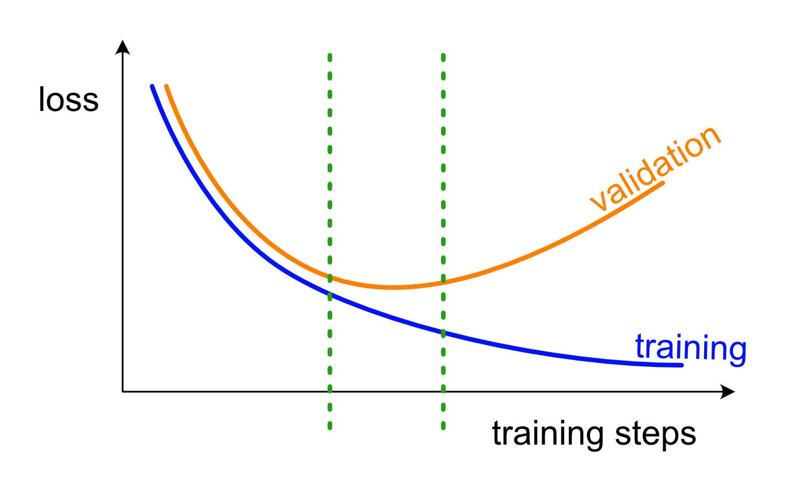
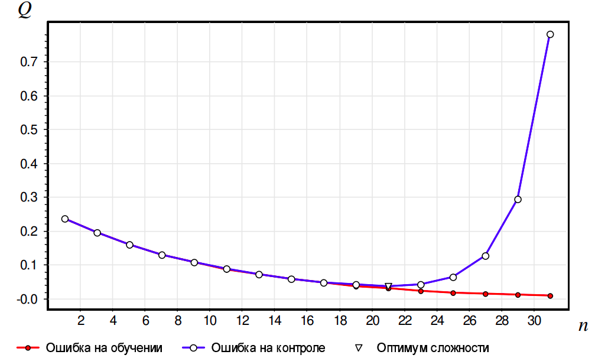
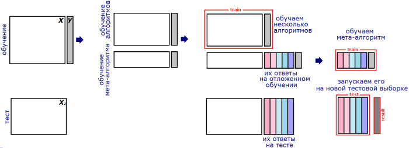
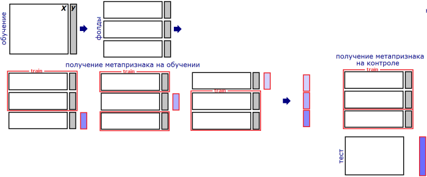

# Ансамбли. Градиентный бустинг

## Recap: Bias-Variance Decomposition

Решение задач классического машинного обучения почти всегда сводится к минимизации некоторого эмпирического риска некоторыми итеративными процедурами. Обычно ML-ученый при обучении модели наблюдает кривую обучения (learning curve), подобную следующей:

Эмпирический риск, посчитанный на обучающей выборке (training), может уменьшаться без конца, в то время как риск, посчитанный на отложенной выборке (validation), не может. Грамотный ML-ученый в качестве результата обучения будет предоставит ту версию модели, которая находится посередине между переобучением (overfitting) и недообучением (underfitting), в “зеленой” зоне.

Похожий эффект можно наблюдать не только во время обучения одной модели, но и во время обучения множества моделей с различной *сложностью* (complexity, capacity). Знаменитый пример Рунге:

На графике изображен эмпирический риск регрессионной модели (интерполяционного полинома), обученного аппроксимировать функцию $y(x)=1/(1+25x^2)$. По горизонтали отмечена степень интерполяционного полинома. Мы можем говорить, что это разные модели, причем чем больше степень, тем модель *сложнее*. 

Такой график отражает более глобальную проблему машинного обучения, нежели проблему останова оптимизации, — проблему выбора сложности модели. Одна из известных формализаций этой проблемы — понятие о bias-variance decomposition (BVD).

Рассмотрим пример. Пусть целевая функция моделируется как $y(x)=\mathbb{E}[y\mid x]+\varepsilon$, где $\varepsilon$ — случайный шум. Введем среднеквадратический риск (MSE) алгоритма $b(x)$ по всем возможным обучающим выборкам $X=(x_i,y_i)_{i=1}^\ell$:
$$
L(b)=\mathbb{E}_X[\mathbb{E}_{(x,y)\sim X}[(y-b(x))^2]].
$$
Для такой задачи известен BVD:
$$
L(X,a)=\underbrace{\mathbb{E}_{x,y}[\varepsilon ^2]}_\text{noise}+\underbrace{\mathbb{E}_x[(\mathbb{E}_X[a(x)]-\mathbb{E}[y\mid x])^2]}_\text{bias}+\underbrace{\mathbb{E}_x[(\mathbb{E}_X[a(x)]-a(x))^2]}_\text{variance}.
$$
BVD переводит абстрактные понятия о недообучении и переобучении на язык эмпирических ошибок. Рассмотрим четыре случая, изображенных на рисунке ниже:

Рисунок является визуальной аналогией: точность предсказания на тестовом объекте изображена как точность попадания стрелка в мишень. Разные точки соответствуют разным обучающим выборкам $X$.

1. Левая верхняя мишень соответствует алгоритму, который находится в “зеленой” зоне кривой сложности (график 2 в выше). Этот алгоритм способен сойтись к какому-то плюс-минус одинаковому предсказанию вблизи $\mathbb{E}[y\mid x]$, и при этом с изменением обучающей выборки его предсказаник не сильно меняется.

2. Правая верхняя мишень соответствует алгоритму, который склонен к переобучению. Даже при малых изменениях обучающей выборки, он выдает сильно меняющиеся предсказания.

3. Левая нижняя мишень соответствует алгоритму, который склонен к недообучению. Для любой выборки он способен сойтись к какому-то плюс-минус одинаковому предсказанию, но это предсказание не соответствует истинному $\mathbb{E}[y\mid x]$.

4. Правая нижняя мишень очевидно соответствует алгоритму, неудачному в обоих смыслах.

## Ансамблирование независимых алгоритмов

Глядя, на эти мишени, легко придумать способ решения каждой проблемы.

- Результаты обучения правого верхнего алгоритма на разных выборках достаточно усреднить — получится уменьшение дисперсии. На этом основаны bagging (bootsrap aggregating) и pasting.
- Если взять много разных алгоритмов из левого нижнего угла и над их выходами обучить еще один мета-алгоритм, то получится предсказать истинную метку без смещения. На этом основаны blending и stacking.

**Подробнее про bagging и pasting.** Если просто взять и обучить один алгоритм, склонный к переобучению, на одной и той же выборке, то мы получим набор сильно скоррелированных моделей. Дисперсия в таком случае не уменьшается (доказано на занятии про BVD). Чтобы снизить корреляцию между разными моделями, их получают из разных выборок. В случае bagging, эти выборки получаются как выборки с возвращением. В случае pasting просто берут непересекающиеся подвыборки.

**Подробнее про blending.** Обучающую выборку делят на две части. На первой обучают базовые алгоритмы. Затем получают их ответы на второй части и на тестовой выборке. Понятно, что ответ каждого алгоритма можно рассматривать как новый признак (т.н. «мета-признак»). На метапризнаках второй части обучения настраивают мета-алгоритм. Затем запускают его на мета-признаках теста и получают ответ.

**Подробнее про stacking.** Выборку разбивают на части (фолды), затем последовательно перебирая фолды обучают базовые алгоритмы на всех фолдах, кроме одного, а на оставшемся получают ответы базовых алгоритмов и трактуют их как значения соответствующих признаков на этом фолде. Для получения метапризнаков объектов тестовой выборки базовые алгоритмы обучают на всей обучающей выборке и берут их ответы на тестовой.

## Градиентный бустинг

### Общая идея

Это тоже метод ансамблирования, но не такой простой как предыдущие. Все предыдущие методы обучали базовые алгоритмы независимо друг от друга и даже старались сделать их некоррелированными. Идея бустинга в том, чтобы обучать алгоритмы последовательно, чтобы каждый следующий базовый алгоритм немного уменьшал ошибку ансамбля из всех прыдыдущих базовых алгоритмов.

Опишем процесс градиентного бустинга для задачи регрессии.

1. Обучим первый базовый алгоритм $b_1$ предсказывать целевую переменную $Y=(y_1,\ldots,y_\ell)$. Его предсказания на объектах обучающей выборки $x_i\in X$ не идеальны и имеют ошибку $s_i^1=y_i-b_1(x_i)$.
2. Возьмем второй алгоритм $b_2$ и обучим его не на $Y$ (как это было бы в методах из предыдущего раздела), а на $S^1=(s^1_1,\ldots,s^1_\ell)$. Зачем это нужно? Затем, что теперь для любого объекта $x$ можно сделать предсказание сначала с помощью алгоритма $b_1$, а затем скорректировать ошибку этого предсказания с помощью алгоритма $b_2$. Реализуется это так: $y(x)\approx a_2(x):=b_1(x)+b_2(x)$.
3. Возьмем третий алгоритм $b_3$ и обучим его предсказывать ошибки $s_i^2=y_i-a_2(x_i)$. Тогда для приозвольного объекта $x$ можно сделать еще более точное предсказание $y(x)\approx a_3(x):=a_2(x)+b_3(x)$

4. И так далее пока ошибка не перестанет значимо уменьшаться.

В итоге получается ансамбль $a_N(x)=\sum_{j=1}^N b_j(x)$.

### Интерпретация. Почему он градиентный?

Квадратичная ошибка предсказания $z$:
$$
L(y_i,z)={1\over2}(y_i-z)^2.
$$
Заметим, что поскольку мы решаем задачу регрессии, то в конечном счете, мы хотим решить задачу оптимизации MSE ошибки:
$$
L(y_i,a(x_i))={1\over2}(y_i-a(x_i))^2.
$$
Если бы имели в качестве $a$ параметрическую модель $a_w$ (например, $a_w(x)=w^Tx$), то мы бы взяли градиент этого функционала по весам модели:
$$
{\partial \over\partial w} L(y_i,a_w(x_i))=(y_i-a_w(x_i))\left(-{\partial a_w(x_i)\over\partial w}\right).
$$
Но в случае бустинга $a_n(x)=\sum^n_j b_j(x)$ мы пытаемся менять не веса модели, а сами предсказания модели:
$$
{\partial \over\partial z} L(y_i,z)\bigg|_{z=a_n(x_i)}=y_i-a_n(x_i)=:s_i^n.
$$
Полученное равенство показывает связь между ошибкой ансамбля из $n$ алгоритмов $s_i^n$ и градиентом функции потерь — оказывается, это одно и то же. 

Согласно описанной процедуре бустинга, базовый алгоритм $b_{n+1}$ обучается предсказывать ошибку $S^n=(s_1^n,\ldots,s_\ell^n)$. А эта ошибка, есть ни что иное как градиент ${\partial\over\partial z}L$ (градиент в пространстве предсказаний $z$). Поэтому каждый шаг бустинга есть шаг градиентого спуска.

### Простейшие техники регуляризации градиентного бустинга

Открывшаяся интерпретация градиентного бустинга объясняет следующие два приема, которые используют при реализации ванильного градиентного бустинга.

Во-первых, чтобы градиентный спуск был плавным и равномерным, необходимо выставить шаг обучения (learning rate). Для этого каждый новый базовый алгоритм $b_{n+1}$ так же обучают на ошибку $S_n=(y_i-a_n(x_i))_{i=1}^\ell$, но в ансамбль добавляют по следующему правилу:
$$
a_{n+1}(x):=a_n(x)+\eta \cdot b_{n+1}(x),
$$
где $\eta$ — learning rate.

Во-вторых, для равномерности спуска в качестве первого алгоритма $b_1$ выбирают опимальное константное предсказание. Дело в том, что в нашем градиентом спуске всегда выбирается нулевое начальное приближение, а затем делаются градиентные шаги $b_1$, $b_2$ и так далее. Чтобы как-то улучшить первое приближение, в качестве алгоритма $b_1$ используют, например, среднее значение целевой переменной.

Существует и другое объяснение второму приему: если не взять $b_1=\text{const}$, то скорее всего $b_1$ выудит из выборки так много информации, что последующие алгоритмы $b_2,b_3,\ldots$ будут обучаться на остаточный шум и эффекта бустинга не получится.

Это были простейшие техники регуляризации. Однако даже вместе с ними градиентный бустинг долгие годы был очень слабым алгоритмом и непопулярным решением. Однако в 2010-ых годах он стал SOTA-алгоритмом всего классического машинного обучения. Произошло это благодаря изобретению более сложных и продуманных техник регуляризации и различных оптимизаций вычислений. Речь о современных имплементациях бустинга пойдет в следующих занятиях.

## Источники

- Лекция К. Воронцова, вводная в машинное обучение: https://github.com/MSU-ML-COURSE/ML-COURSE-23-24/blob/main/slides/2_stream/msu23-intro.pdf

- Лекция Е. Соколова про BVD: https://github.com/esokolov/ml-course-hse/blob/master/2020-fall/lecture-notes/lecture08-ensembles.pdf
- Лекция К. Воронцова про ансамбли (часть 1): https://github.com/MSU-ML-COURSE/ML-COURSE-23-24/blob/main/slides/2_stream/msu23-compos1.pdf
- Лекция К. Воронцова про ансамбли (часть 2): https://github.com/MSU-ML-COURSE/ML-COURSE-23-24/blob/main/slides/2_stream/msu23-compos2.pdf
- Блог А. Дьяконова “Стекинг и блендинг”: https://alexanderdyakonov.wordpress.com/2017/03/10/c%d1%82%d0%b5%d0%ba%d0%b8%d0%bd%d0%b3-stacking-%d0%b8-%d0%b1%d0%bb%d0%b5%d0%bd%d0%b4%d0%b8%d0%bd%d0%b3-blending/
- Рукописный конспект Р. Авдеева: https://github.com/mmp-mmro-team/mmp_mmro_fall_2023/blob/main/%D0%A0%D1%83%D0%BA%D0%BE%D0%BF%D0%B8%D1%81%D0%BD%D1%8B%D0%B9_%D0%BA%D0%BE%D0%BD%D1%81%D0%BF%D0%B5%D0%BA%D1%82_grad_boosting.pdf
